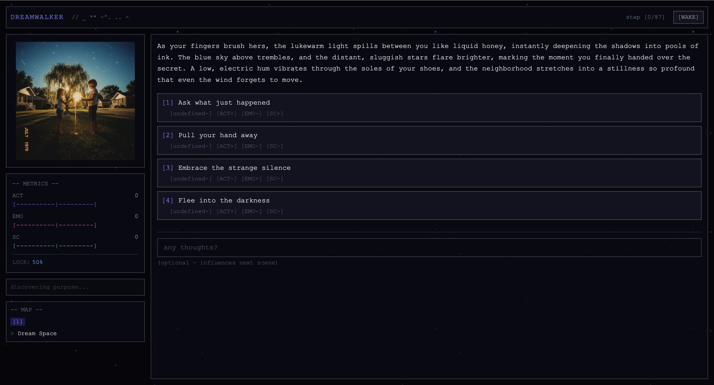

# Dreamwalker

An AI-driven narrative RPG that generates an interactive dream in response to a single opening thought. A multi-agent system built on Google Gemini collaboratively writes the story, picks branching choices, illustrates each scene, and scores the emotional trajectory — all in real time.

---



---

## How it plays

1. You type a thought — a feeling, a place, an image.
2. An **Initiator** agent turns it into a dream world with its own writing style and visual/audio aesthetic.
3. A loop runs:
   - **Storyteller** writes the next 2–4 sentences of narrative.
   - **Brancher** surfaces 1–4 choices you can act on.
   - **Judge** scores the scene on three psychological axes: _arousal_, _valence_, and _self-awareness_ (lucidity).
   - **Director** paces the narrative — changing locations, triggering events, or ending the dream when metrics say you should wake.
4. Scenes are illustrated with Gemini image generation; ambient music tracks your emotional state live via Lyria.

## Stack

- **Client** — React 19, Vite, TypeScript, Tailwind 4, Zustand (run with Bun)
- **Server** — Bun, Express 5, WebSocket (`ws`), TypeScript
- **AI** — Google Gemini (text, image, Lyria real-time music)
- **Shared** — TypeScript types for game state, steps, metrics, and decisions

Monorepo: `client/`, `server/`, `shared/`.

## Run it

```bash
bun install
bun run dev          # starts client + server together
bun run dev:client   # client only (Vite)
bun run dev:server   # server only (Bun watch)
bun run build
bun run test
```

## Environment

Create `.env` in `server/`:

```
GOOGLE_API_KEY=your_key_here
PORT=3001             # optional
```

## Server endpoints

- `POST /api/session/*` — session lifecycle, step generation, decision handling
- `GET /api/media/*` — cached image and audio delivery
- `ws://…/api/audio` — real-time audio stream from Lyria

Sessions live in memory with a 5-minute cleanup sweep; no database, no auth.
