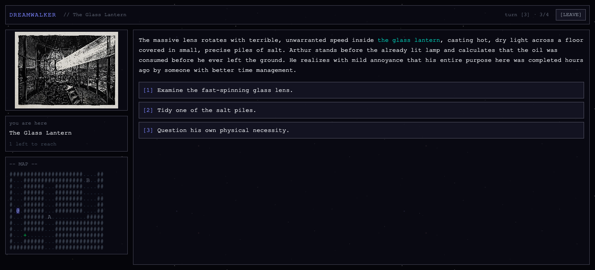

# Dreamwalker

A short interactive story that is generated while you play it. You give it one
sentence, or you let it reach for the news; it writes a world, draws a small
walkable map of it, illustrates each place, scores an ambient soundtrack live,
and at the end shows you what your run became — and, for a news story, how far
it drifted from what actually happened.

A game takes two to ten minutes. Polish and English, with the language of the
story and the language of the interface set separately.

---



---

## How it plays

1. **Pick a mode.** Type an idea and it builds a story around it. Leave the box
   empty and it reaches for real news instead — Polish or world.
2. **A style card is drawn**: genre, narrative voice, tone, the role you play,
   a visual style, a musical mood, a pace. It runs through every stage after
   it, so two games from the same idea do not look or read alike.
3. **You walk a map.** An ASCII tile grid with walls, locked doors and lettered
   destinations. Doors open as you reach the places that unlock them.
4. **Each place is a scene**: a few sentences, three things you could do, and
   once or twice a run, a question you answer by typing a sentence of your own.
5. **The ending** tells you what your story became. In news mode it sits beside
   what actually happened, with citations and a match score.

Every run is saved and can be replayed.

## Stack

- **web/** — React 19, Vite 7, TypeScript, Tailwind 4, Zustand (run with Bun)
- **backend/** — FastAPI, Pydantic v2, uv-managed, Python 3.12+
- **infra/** — one Docker image, Cloud Run, Terraform
- **AI** — Gemini on Vertex AI for text and images; Lyria RealTime, which is
  Gemini-API-only, for music

There is no `shared/`: `web/src/api/schema.d.ts` is generated from the
backend's own OpenAPI schema, so the frontend cannot drift from the contract.

## Run it

```bash
bun install
bun run dev          # web on :5174, backend on :8000
bun run dev:web      # web only
bun run dev:backend  # backend only
bun run test         # backend tests
bun run gen:api      # regenerate the frontend types (backend must be running)
```

Out of the box it runs on recorded fixtures and spends nothing. See
[docs/SETUP.md](docs/SETUP.md) for the three run modes and for pointing it at a
real Google Cloud project.

## Documentation

| | |
|---|---|
| [docs/SETUP.md](docs/SETUP.md) | Getting it running, locally and on GCP |
| [docs/decisions.md](docs/decisions.md) | Every design decision, with the measurements behind it |
| [docs/safety.md](docs/safety.md) | What news mode refuses, and how the rest is handled |
| [docs/style-cards.md](docs/style-cards.md) | The style catalog, generated from the code |
| [infra/README.md](infra/README.md) | Deploying it, and what is deliberately not deployed |
